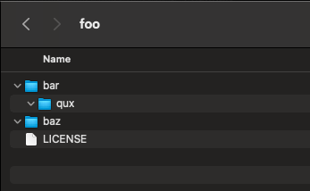

# nolicense

no-bullshit guidelines for distribution and licensing of code

read the license, see how it works for yourself

# why a new license?

current licenses suck.

the gpl is huge and restricts what developers can do with your code. where's the "free" in that?

the bsd license is fantastic but developers can get away with barely crediting the original authors at all

the cddl is a fantastic combination of the best parts of both, but still falls slightly *too* restrictive.

### introducing the nolicense

simple, effective, and truly *free* (as in freedom)

# quickfire questions and answers

let's clear some things up, anything not mentioned here can be opened as an issue or is already in the license file.

### how do i use the nolicense in my project?

all you have to do to use the nolicense is to include the [license document](LICENSE) at the root of any redistributions of your code

### why should i use the nolicense in my project?

the nolicense isn't for everyone. some examples on when it is right to use the nolicense are:

- educational purposes
- when the public domain is too permissive for what you want to achieve
- small, gist-like projects that you are fine with being open

### why should i care?

nobody can force you to care, but the open source software community is very quickly becoming idolistic in its practices. we should not be idolising software, people, anything or anyone. it is an unhealthy way of being

we should instead focus our collective efforts on improving the quality of the software we make, how we share it and how our wants and needs are respected, without having to hide it behind walls of text, paragraphs upon paragraphs in size.

### how can i contribute?

fork the license, contribute however you want to, then create a pull request to this repo

any input from any background is welcome

